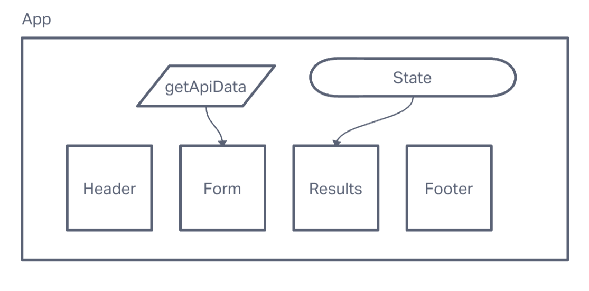

# resty
Lab 26 - Creating a RESTful front-end

# Whiteboard

## Dependencies
vite react

## Requirements
### 1
- Convert all child components of <App /> from classes to functions.
- The <App /> component serves as the container for all sub-components of this application. Leave this component as a Class.
- Make sure all base styles for <App /> are included in a .scss imported within the App.jsx file.
- Ensure that the <Header />, <Footer />, <Results /> and <Form /> components are imported using ES6 import syntax.

### 2
- Each of the components should have its own scss file.

### 3
- <Form /> component should call a function **onSumbmit()** passed down from App that updates the App component.
- <Results /> should show mock API results.